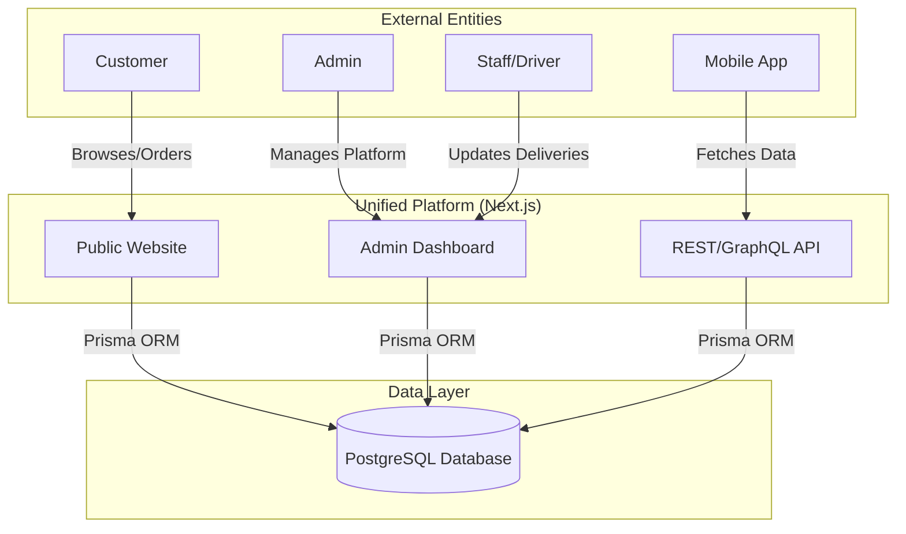
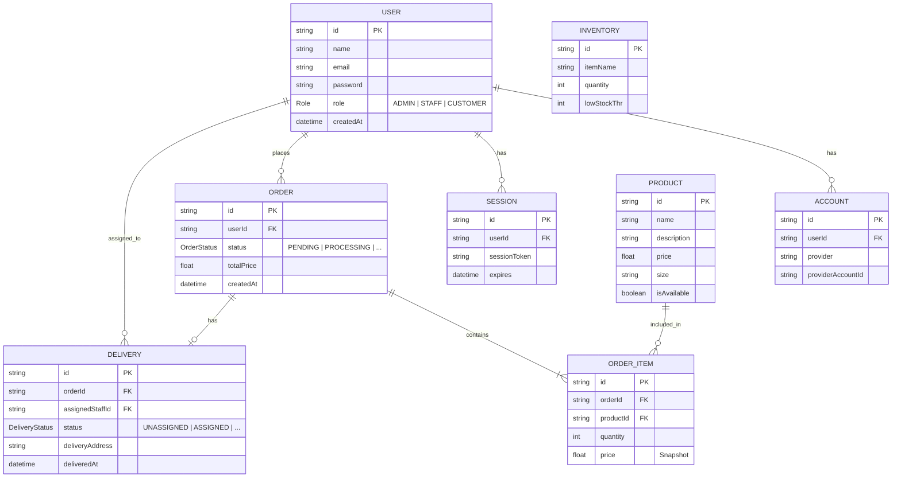
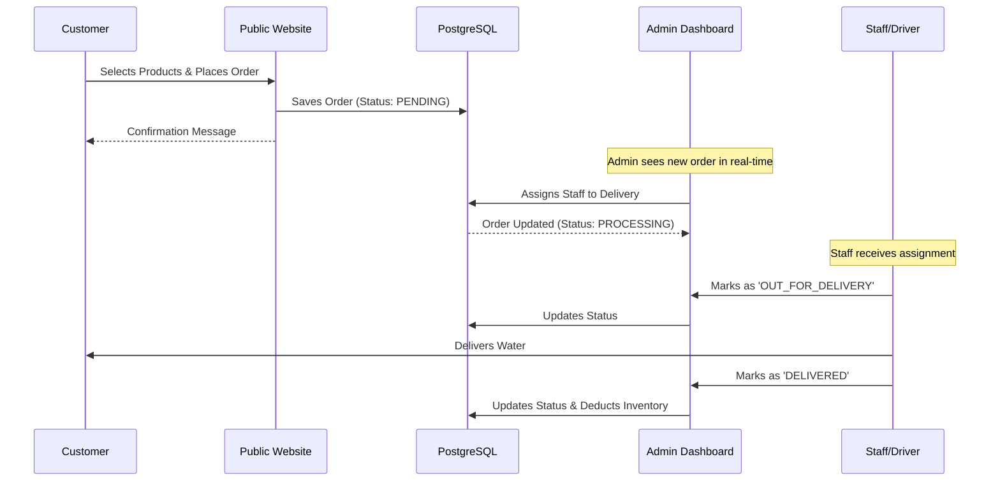
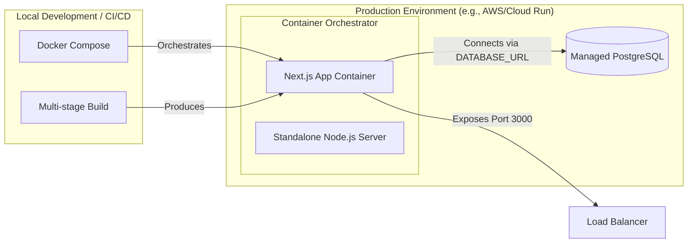

# Water Refill Station Unified Platform: Architecture Diagrams

This document provides a visual representation of the unified platform architecture as described in the `unified-platform-architecture.md` technical design document.

## 1. System Landscape Diagram
This diagram shows the high-level actors and their interactions with the unified platform.



## 2. Application Component Diagram
This diagram details the internal structure of the Next.js App Router and shared logic.

```mermaid
graph TB
    subgraph "Next.js App Router (src/app)"
        subgraph "(public) Group"
            P1[Home Page]
            P2[Products Page]
            P3[About/Contact]
        end
        
        subgraph "(admin) Group"
            A1[Dashboard Metrics]
            A2[Order Management]
            A3[Inventory/Delivery]
        end
        
        subgraph "api Group"
            API_R[Auth/Orders/Products Routes]
        end
    end

    subgraph "Shared Core (src/)"
        COMP[UI Components - shadcn/ui]
        LIB[Lib - Utils/Prisma Client]
        AUTH[NextAuth.js Config]
        TYPE[Types/Interfaces]
    end

    subgraph "Database Access"
        PRISMA[Prisma Schema/Client]
    end

    (public) --> COMP
    (public) --> LIB
    (admin) --> COMP
    (admin) --> AUTH
    api --> AUTH
    api --> LIB

    COMP --> TYPE
    LIB --> PRISMA
```

## 3. Entity-Relationship Diagram (ERD)
Based on the implementation in `prisma/schema.prisma`.



## 4. Sequence Diagram: Order Placement Flow
Illustrating the interaction between the public website, admin dashboard, and staff.



## 5. Deployment Architecture (Containerization)
Visualizing the Docker-based deployment strategy.


