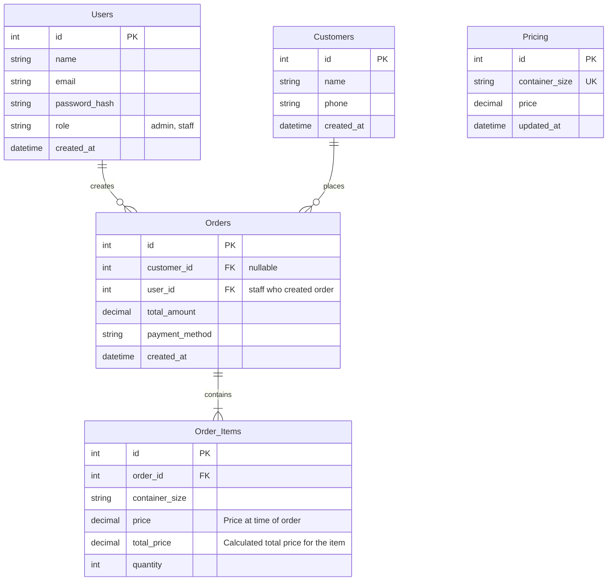

# Database Architecture

This document defines the data layer for the Water Refill Station Management System.

## 1. Entity Relationship Diagram (ERD)

## 2. Schema Details

### 2.1 Users
Stores staff and admin credentials for authentication and authorization.
- **`role`**: Enforces Role-Based Access Control (RBAC).

### 2.2 Customers
Stores public users who place orders.
- **`phone`**: Primary contact method.

### 2.3 Orders
Records individual sales transactions.
- **`total_amount`**: The total cost of the order.
- **`payment_method`**: Cash, Card, Mobile Money, etc.

### 2.4 Order_Items
Details the line items within a specific order.
- **`price`**: Captures the historical price at the time of the transaction to maintain data integrity if `Pricing` changes.
- **`total_price`**: Subtotal for this specific line item (`price * quantity`).

### 2.5 Pricing
Independent reference table for current product pricing.
- **`container_size`**: Unique identifier for product size.