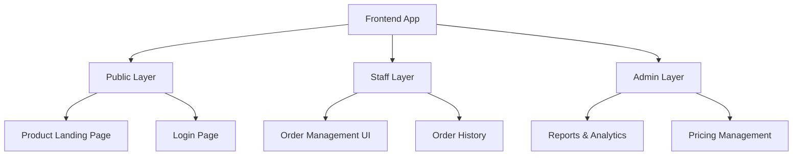
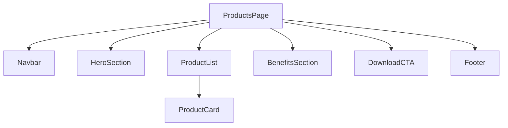
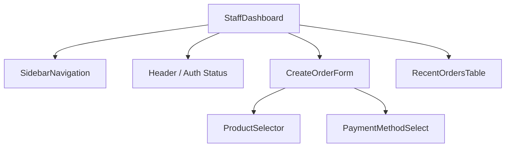
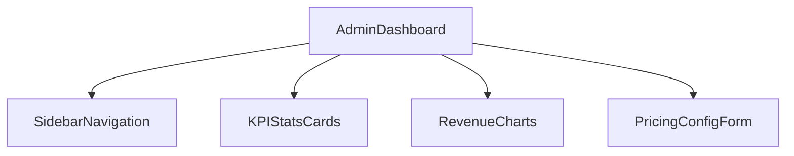
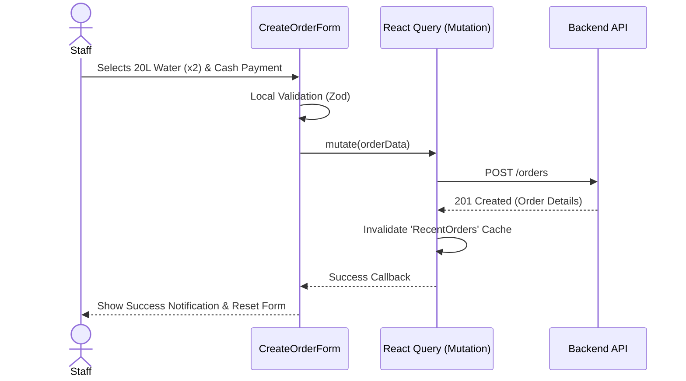

# Frontend Architecture

This document defines the client-side application structure, state management, and component design for the Water Refill Station Management System.

## 1. Application Layers

---

## 2. Route Structure

- `/`                 → Product Landing Page (Public)
- `/download`         → App Download Page
- `/auth/login`       → Login
- `/staff`            → Staff Dashboard (Order Creation & History)
- `/admin`            → Admin Dashboard (Overview)
- `/admin/pricing`    → Pricing Management
- `/admin/reports`    → Reports & Analytics

---

## 3. State Management

The frontend utilizes a hybrid state management approach:

- **Server State:** `React Query` (or SWR) for fetching, caching, and synchronizing data from the Backend API (e.g., product pricing, order history, reports).
- **Global UI State:** `Zustand` or `React Context` for lightweight global state (e.g., User Session, Auth Token, Theme/Dark Mode).
- **Local Form State:** `React Hook Form` combined with `Zod` for complex form validation (e.g., Order creation form, Login form).

---

## 4. Component Design

### 4.1 Public Landing Page
The primary goal is to display available water products, show pricing, and drive mobile app downloads.

### 4.2 Staff Dashboard
The staff dashboard focuses on operational efficiency, allowing staff to quickly create and view orders.

### 4.3 Admin Dashboard
The admin dashboard provides high-level business analytics and configuration settings.

---

## 5. Data Flow Example (Staff Order Creation)

