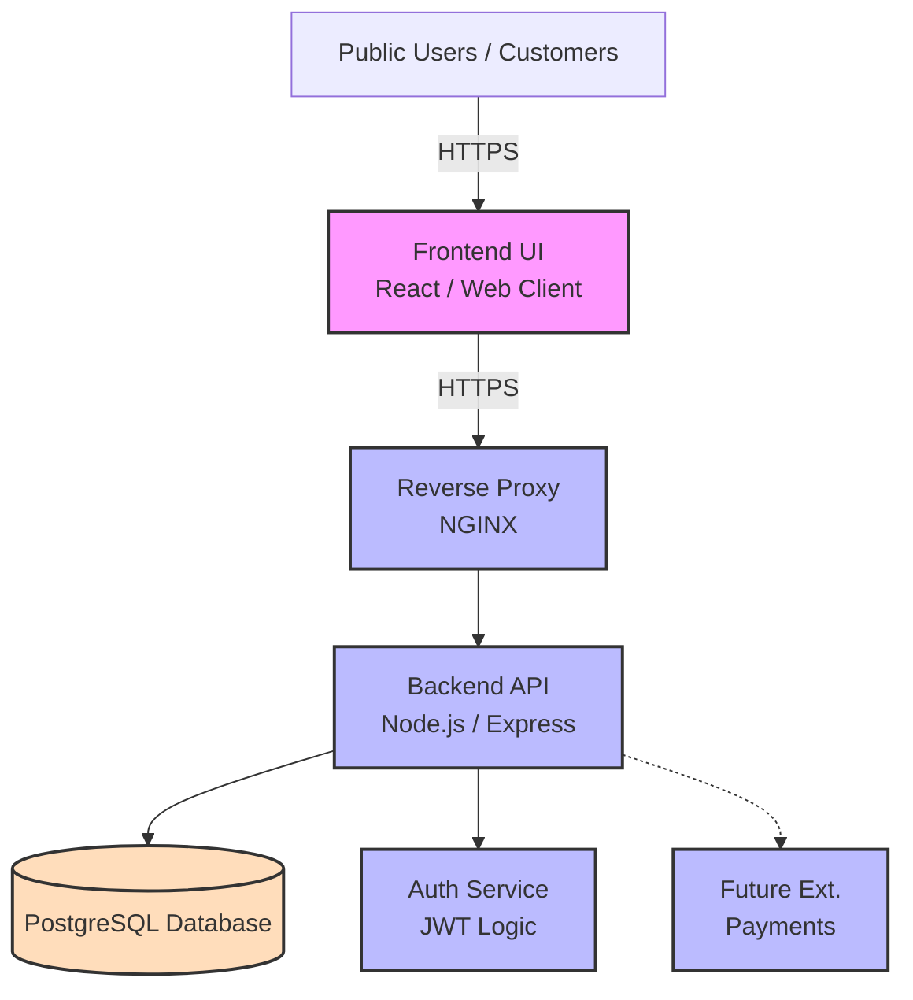
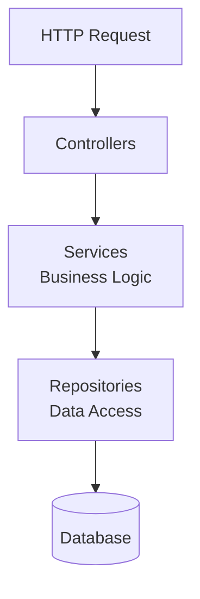
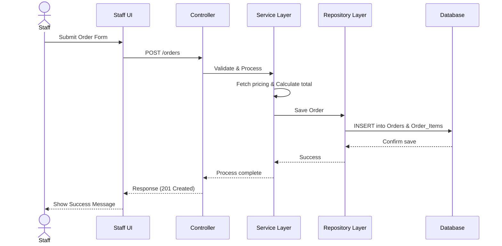
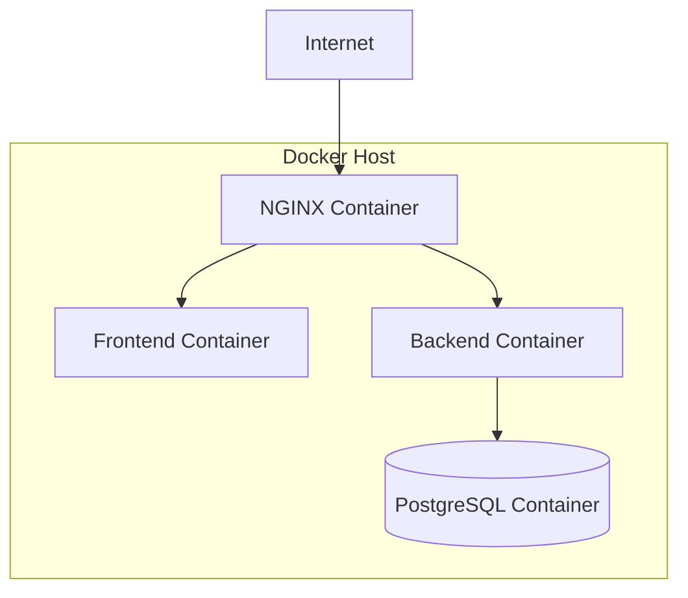
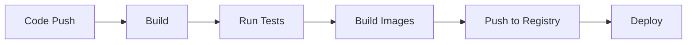

# Water Refill Station Management System

## 1. Overview

This document defines the system architecture, component design, data flow, and deployment strategy for the Water Refill Station Management System. It translates the requirements into an actionable engineering blueprint.

For detailed API and Database specifications, please refer to:
- [API Documentation](API.md)
- [Database Architecture](DATABASE.md)
- [Frontend Architecture](FRONTEND_ARCHITECTURE.md)

---

## 2. High-Level Architecture

The system follows a **3-tier architecture**:

* **Presentation Layer** → Frontend (UI)
* **Application Layer** → Backend API
* **Data Layer** → Database

### 2.1 Architecture Diagram

---

## 3. Component Design

### 3.1 Route Design
- `/`                 → Products Page (Public)
- `/auth/login`       → Staff/Admin Login
- `/staff`            → Staff Dashboard
- `/admin`            → Admin Dashboard

### 3.2 Frontend (Client Application)
**Technology:** React (with Vite or Next.js)
**Responsibilities:** Render UI, Handle interactions, Communicate with API, Manage local state.
See [Frontend Architecture](FRONTEND_ARCHITECTURE.md) for details.

### 3.3 Backend (API Layer)
**Technology:** Node.js (Express or NestJS)
**Responsibilities:** Business logic, Auth, Validation.

### 3.4 Database Layer
**Technology:** PostgreSQL
**Responsibilities:** Persistent storage, relational integrity, transactions.
See [Database Architecture](DATABASE.md) for details.

---

## 4. Backend Architecture (Layered)

---

## 5. Data Flow (Order Processing)

---

## 6. Authentication & Security Design

- **Password Hashing:** bcrypt
- **Auth:** JWT-based authentication
- **RBAC:** Role-based access control (Admin vs Staff)
- **Input Validation:** Prevent SQL injection and XSS
- **Transport:** HTTPS enforcement in production

---

## 7. Deployment Architecture

### 7.1 Docker-Based Deployment

---

## 8. CI/CD Pipeline Design

## 9. Future Enhancements
* Microservices split (Orders, Payments, Reporting)
* Event-driven architecture (Kafka/RabbitMQ)
* Caching layer (Redis)
* Monitoring (Prometheus + Grafana)
* Kubernetes Deployment
